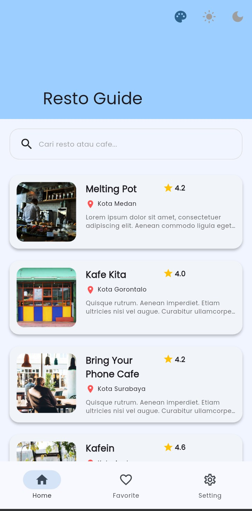
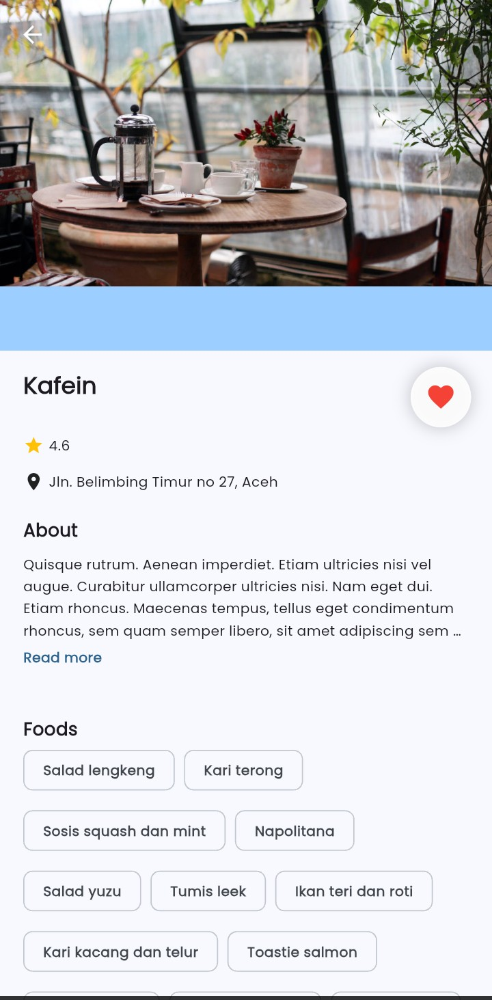
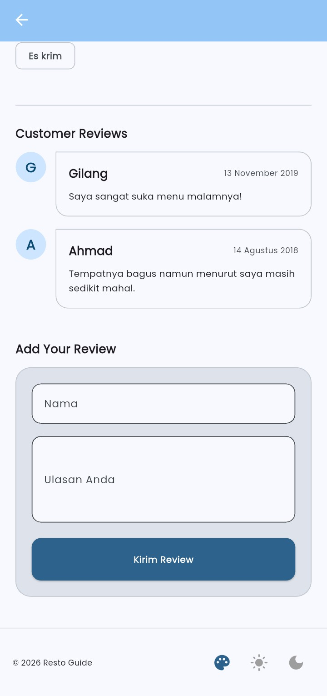
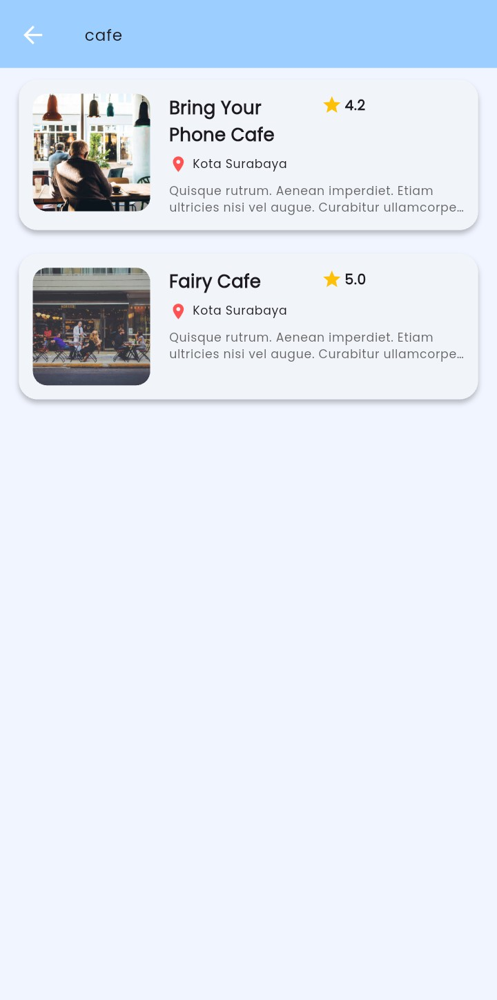
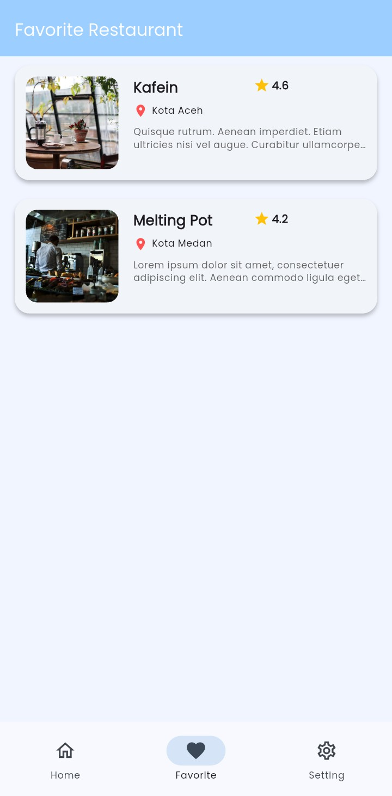
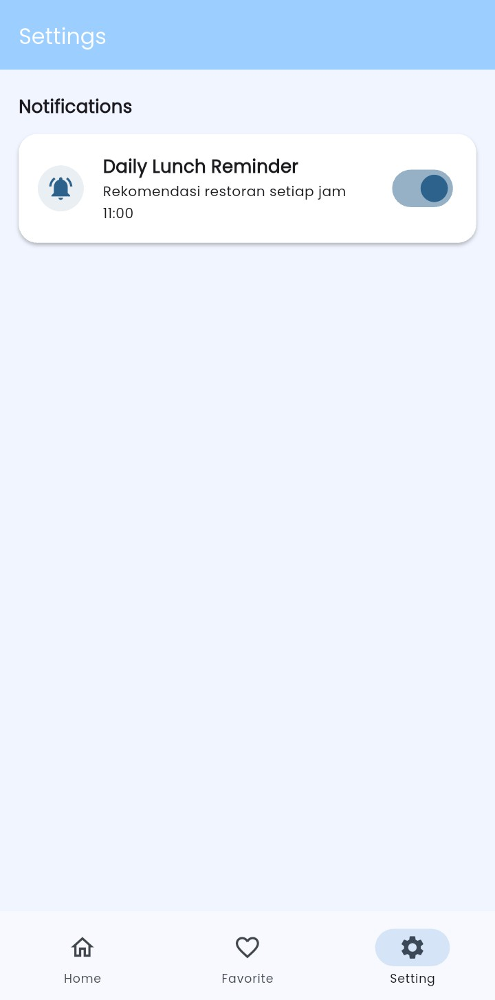

# 🍽️ Resto Guide App

Resto Guide adalah aplikasi Flutter yang menampilkan daftar restoran, detail restoran, pencarian, fitur ulasan pelanggan, fitur favorit dan pengingat makan siang.  
Aplikasi ini dibangun sebagai projek submission pada program IDCamp di Dicoding Akademi dengan fokus pada penerapan **State Management (Provider)**, **REST API**, dan **Material 3**.

---

## ✨ Fitur Utama

- 📋 Daftar restoran
- 🔍 Pencarian restoran
- 📄 Detail restoran (deskripsi, alamat, menu)
- ⭐ Rating restoran
- 💬 Daftar ulasan pelanggan
- ✍️ Kirim ulasan restoran
- ⭐ Favorite Restaurant (SQLite)
- 🔔 Daily Reminder Notification (11 AM)
- 🎨 Shared Preferences pada fitur Ubah tema (Light, Dark, Soft Blue)
- 🌐 Konsumsi REST API Dicoding

---

## 📸 Screenshot Aplikasi

| Home                          | Detail                            | Review                            |
| ----------------------------- | --------------------------------- | --------------------------------- |
|  |  |  |

| Search                        | Favorite                          | Setting                           |
| ----------------------------- | --------------------------------- | --------------------------------- |
|  |  |  |

---


## 🧱 Arsitektur & Teknologi

- **Framework**: Flutter
- **State Management**: Provider
- **API**: Dicoding Restaurant API
- **UI**: Material 3
- **Font**: Poppins
- **HTTP Client**: http
- **Pattern**:
  - Separation of Concerns
  - Provider + ChangeNotifier
  - Sealed Class (`ResultState`)

---

## 🗂️ Struktur Folder

```text
lib/
├── data/
│   ├── api/
│   │   └── resto_api_service.dart
│   ├── database/
│   │   └── local_database_service.dart
│   └── model/
│       ├── resto_list_response.dart
│       └── resto_detail_response.dart
│
├── provider/
│   ├── resto_list_provider.dart
│   ├── resto_detail_provider.dart
│   ├── search_provider.dart
│   ├── theme_provider.dart
│   ├── reminder_provider.dart
│   └── local_database_provider.dart
│
├── services/
│   └── notification_service.dart
│
├── ui/
│   ├── pages/
│   │   ├── home_page.dart
│   │   ├── search_page.dart
│   │   ├── detail_page.dart
│   │   ├── favorite_page.dart
│   │   └── settings_page.dart
│   │
│   └── widgets/
│       ├── restaurant_card.dart
│       ├── customer_review_list.dart
│       ├── review_form.dart
│       └── theme_footer.dart
│
├── utils/
│   └── result_state.dart
│
└── main.dart
```

---

## 🔁 State Management

Aplikasi ini menggunakan **satu state management**, yaitu **Provider**, sesuai dengan kriteria submission.

---

## 🎨 Theme Management

Aplikasi mendukung 3 tema:

* ☀️ Light
* 🌙 Dark
* 🔵 Soft Blue

Tema dikelola menggunakan `ThemeProvider` dan `ThemeData` terpusat di `AppTheme`.

---

## 🚀 Cara Menjalankan Project

1. Clone repository

   ```bash
   git clone 

2. Masuk ke folder project

   ```bash
   cd resto-guide-app
   ```
3. Install dependencies

   ```bash
   flutter pub get
   ```
4. Jalankan aplikasi

   ```bash
   flutter run
   ```

---

## 🌐 API Reference

Menggunakan **Dicoding Restaurant API**
Base URL:

```
https://restaurant-api.dicoding.dev
```

Endpoint yang digunakan:

* `/list`
* `/detail/{id}`
* `/search?q=`
* `/review`

---

## 👩‍💻 Author

**Endah**
📍 Indonesia

---

## 📄 License

This project is licensed for educational and portfolio purposes.